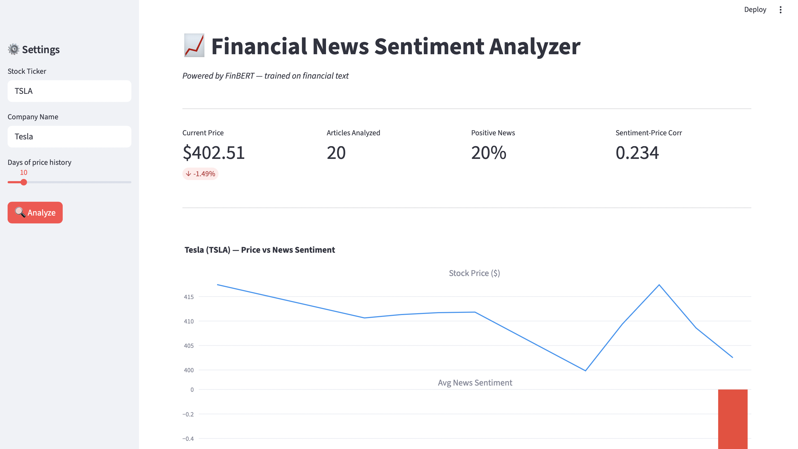
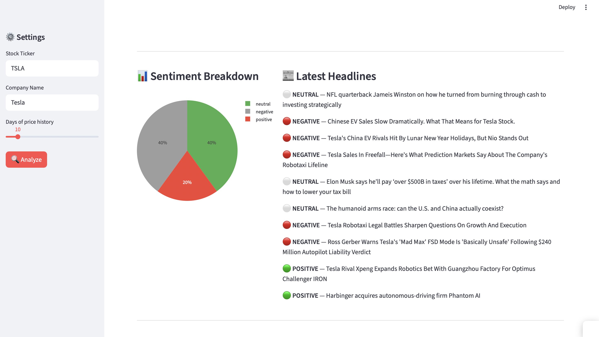

# 📈 Financial News Sentiment Analyzer

> NLP-powered web app that analyzes financial news sentiment and overlays it with real-time stock price data using FinBERT — a transformer model fine-tuned on financial text.





---

## 🌐 Live Demo
👉 **[Open App](https://nurayarpa-financial-sentiment-analyzer-app-gzxrct.streamlit.app)**

---

## 📌 Project Overview

This project combines **NLP** and **financial analysis** to answer a practical question:
*Does news sentiment around a company correlate with its stock price movement?*

The pipeline:
1. Fetches real-time financial headlines from Yahoo Finance RSS
2. Classifies each headline as **Positive / Negative / Neutral** using FinBERT
3. Aggregates daily sentiment scores
4. Overlays them with historical stock prices via `yfinance`
5. Calculates sentiment-price correlation

---

## 🤔 Why These Models?

### VADER — Baseline
VADER is a rule-based sentiment model that assigns pre-defined scores to words and sums them up. No training required.

We use it as a **baseline** — every ML project needs one. Without a baseline, you can't claim your model is "good". Good compared to what?

**Limitation:** VADER doesn't understand context or financial language:
- *"Missed guidance"* → VADER: neutral ❌ | FinBERT: negative ✅
- *"Beat estimates"* → VADER: neutral ❌ | FinBERT: positive ✅
- *"Not doing well"* → VADER: positive (sees "well") ❌ | FinBERT: negative ✅

### FinBERT — Main Model
FinBERT is BERT (Google, 2018) fine-tuned specifically on financial text — earnings calls, analyst reports, and financial news. Unlike VADER, it reads the **full sentence in both directions** to understand context.

We chose FinBERT because:
- It's the **state of the art** for financial NLP tasks
- Pre-trained on financial domain text — no need to train from scratch
- Understands financial-specific language that generic models miss
- Free and open source via HuggingFace

---

## 📊 Model Performance

| Metric | VADER (Baseline) | FinBERT |
|--------|-----------------|---------|
| Accuracy | 0.522 | **0.878** ✅ |
| F1 (weighted) | 0.528 | **0.879** ✅ |

**FinBERT outperforms VADER by +35%** because it understands financial-specific language like *"missed guidance"*, *"write-down"*, and *"beat estimates"* — which rule-based models like VADER get wrong.

---

## 🛠️ Tech Stack

| Layer | Tools |
|-------|-------|
| Data | Yahoo Finance RSS, `yfinance` |
| NLP Model | `FinBERT` (ProsusAI), `HuggingFace Transformers` |
| Baseline | `VADER` (rule-based sentiment) |
| ML Pipeline | `scikit-learn`, `pandas`, `numpy` |
| Visualization | `plotly`, `matplotlib`, `seaborn` |
| App | `Streamlit` |

---

## 📁 Project Structure

```
financial-sentiment/
│
├── app.py                  # Streamlit dashboard
│
├── notebooks/
│   └── news_analysis.ipynb # Full analysis: EDA → Cleaning → VADER → FinBERT
│
├── data/
│   └── data.csv            # Financial PhraseBank dataset
│
├── requirements.txt
└── README.md
```

---

## 🚀 Run Locally

**1. Clone the repo**
```bash
git clone https://github.com/nurayarpa/financial-sentiment.git
cd financial-sentiment
```

**2. Install dependencies**
```bash
pip install -r requirements.txt
```

**3. Run the app**
```bash
streamlit run app.py
```

Open `http://localhost:8501` in your browser.

---

## 📓 Notebook Walkthrough

The full analysis is in `notebooks/news_analysis.ipynb`:

| Step | Description |
|------|-------------|
| 1. EDA | Class distribution, text length analysis, top words per sentiment class |
| 2. Cleaning | Deduplication, tokenization, lemmatization, stopword removal |
| 3. VADER Baseline | Rule-based sentiment with train/test split + 5-fold CV |
| 4. FinBERT | Transformer model inference on test set |
| 5. Comparison | VADER vs FinBERT — metrics, confusion matrices, actual vs predicted |
| 6. Stock Overlay | Real news sentiment vs stock price chart + correlation |

---

## 📌 Key Findings

- **FinBERT F1 of 0.879** on Financial PhraseBank — strong performance on financial-domain text
- **Neutral class is the hardest** to predict (most common in dataset at ~60%)
- **Correlation between sentiment and price** is weak (-0.06 to -0.27) — expected, as price is driven by many factors beyond news alone
- A stronger signal would require: longer news history, multiple sources, and **lag analysis** (does today's news affect *tomorrow's* price?)

---

## ⚠️ Limitations

- Yahoo Finance RSS provides only recent headlines (~48–72 hours), limiting historical sentiment analysis
- Correlation analysis is based on a short window — not suitable for trading decisions
- FinBERT has a 512 token limit — very long articles are truncated

---

## 🔮 Future Improvements

- Add multiple news sources (Reddit `r/investing`, SEC filings, earnings call transcripts)
- Lag analysis: does T-day sentiment predict T+1 price movement?
- Portfolio view: analyze multiple tickers simultaneously
- Fine-tune FinBERT on more recent financial news
- Email/Telegram alerts when sentiment turns strongly negative

---

## 👤 Author

**Your Name**
- 📧 nuray.m.arpa@gmail.com
- 💼 [LinkedIn](https://www.linkedin.com/in/nuray-arpa-698584194/)
- 🐙 [GitHub](https://github.com/nurayarpa)

---

## 📄 Dataset

**Financial PhraseBank** — 4,845 financial news sentences labeled by finance professionals as positive, neutral, or negative.

> Malo, P., Sinha, A., Korhonen, P., Wallenius, J., & Takala, P. (2014). Good debt or bad debt: Detecting semantic orientations in economic texts.
